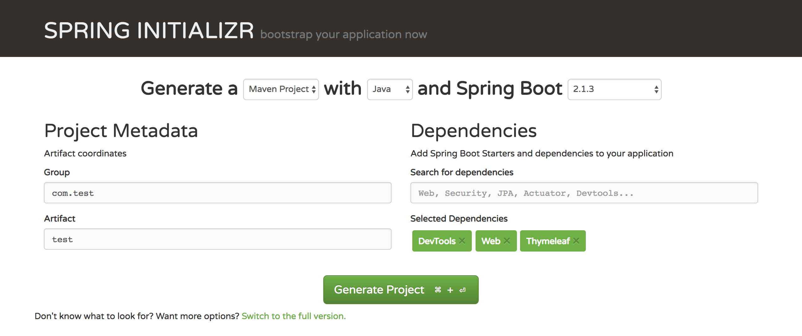
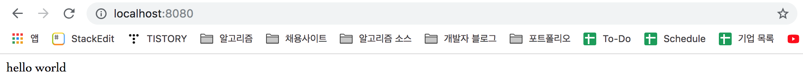
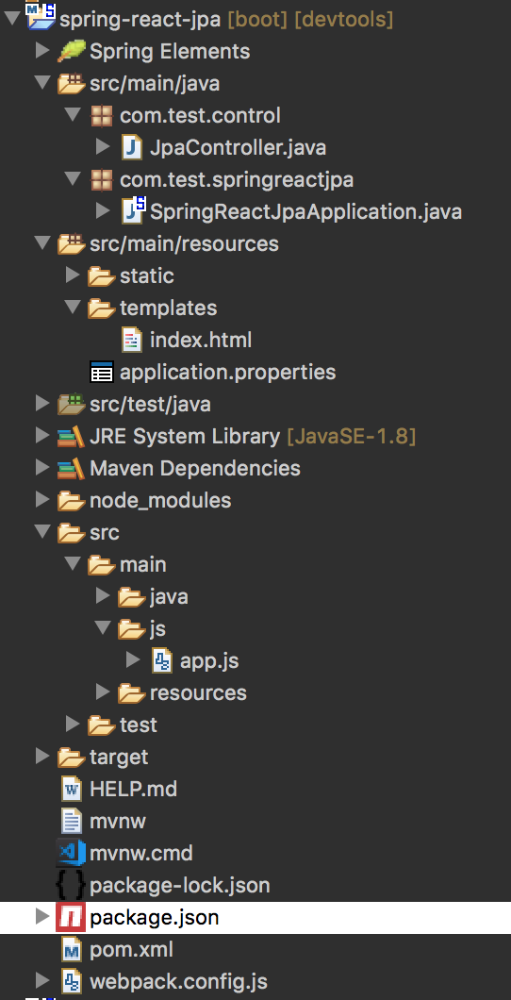
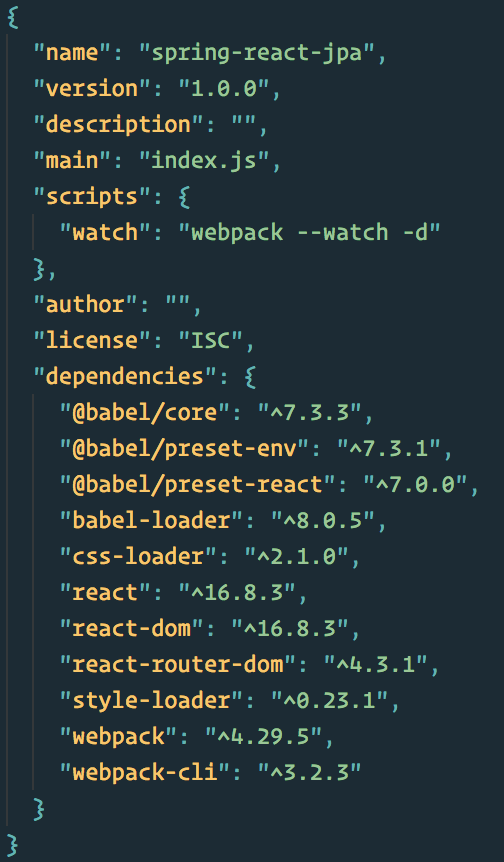
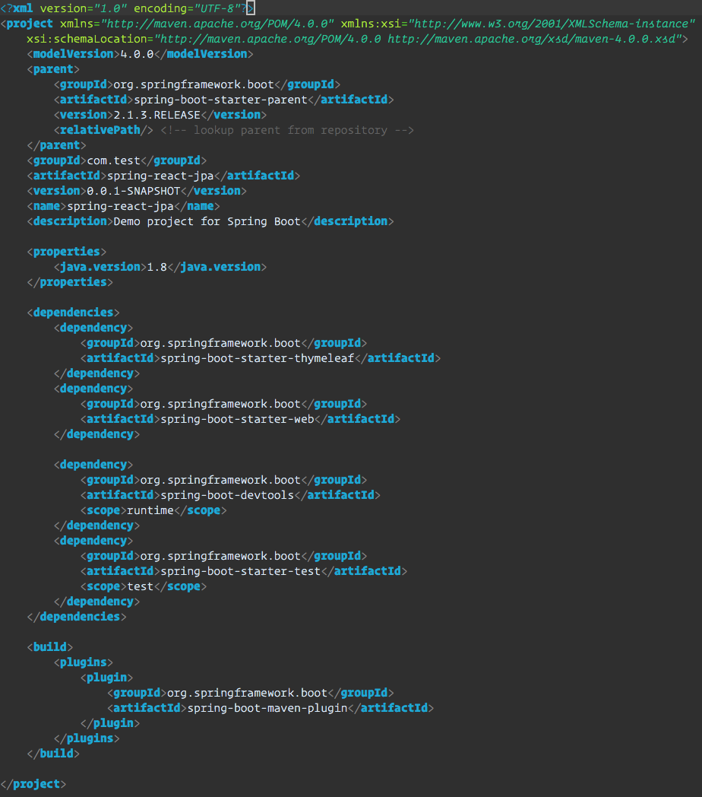

# SPA : Spring Boot + React.js 
This tutorial shows how to create a simple SPA (Single Page Application) with Spring Boot and React.js and the basic setup with webpack. 


[Part 1. Features](#features)  
[Part 2. Environment Setup](#part-2.-environment-setup)  
[Part 3. Run the application](#run)   
[Part 4. Overview](#overview)  
[Part 5. Errors](#part-5-errors)  


<a name=“features”></a>
## Part 1. Features
### 01. SpringBoot		
	
> Spring Boot makes it easy to create stand-alone, ready made Spring Application that you can simple select dependencies with minimum effort. Go check out this web site https://start.spring.io/ to build your own Spring Boot Application and choose dependencies down below. Those are the bear-bone dependencies that we need in this tutorial. Download the maven project into your computer and install it. 

	* Web
	* Thymeleaf
	* DevTool




### 02. React		

> Once you donwnload the Maven project and install project,  you will probably need those three program. We will go through how to install the react dependencies and setup webpack configuration

	* React.js
	* webpack
	* babel


<a name=“environment”></a>
## Part 2. Environment Setup
### 01. React Setup 
#### 1. npm
```
> npm init
> npm install react react-dom react-router-dom
> npm install --save -d @babel/core @babel/preset-env @babel/preset-react babel-loader css-loader style-loader webpack webpack-cli

```

#### 2. webpack.config.js
Create `webpack.config.js` file under project and add this code down blow

```
var path = require('path');

module.exports = {

    entry: {  
          app:'./src/main/js/app.js'  
    },   
        devtool: 'sourcemaps',  
        cache: true,  
        mode: 'development',   
    output: {  
        path: path.resolve(__dirname),  
        filename: './src/main/resources/static/built/[name].bundle.js'  
    },  
    module: {  
        rules: [  
            {  
                test: path.join(__dirname, '.'),  
                exclude: /(node_modules)/,  
                use: [{  
                    loader: 'babel-loader',  
                    options: {  
                        "presets": ["@babel/preset-env", "@babel/preset-react"]
                    }  
                }]  
            }  
        ]  
    }  
};  

```

#### 3. package.json
Add `”watch": "webpack --watch -d"` under `script{}` in package.js

```
"watch": "webpack --watch -d"
```

#### 4. index.html
Create `index.html` file under `src/main/resources/template` directory and Add this code in `<body>` tag

> src > main > resources > templates > index.html

```
<!DOCTYPE html>
<html>
<head>
<meta charset="UTF-8">
<title>Insert title here</ title >
</head>
<body>

    <div id="root"></div>
    <script src="built/app.bundle.js"></script>

</body>
</html>
```

#### 5.  app.js

> src > main > js > app.js

```
  import React, { Component } from 'react'  
	import ReactDOM from 'react-dom'

  export default class App extends Component {  
    render() {  
      return (  
        <div>  
          hello world
        </div>  
      )  
    }  
  }  

  ReactDOM.render(<App />,document.getElementById('root'))  

```

#### 6. Controller

```
package com.test.control;

import org.springframework.stereotype.Controller;
import org.springframework.web.bind.annotation.RequestMapping;

@Controller
public class JpaController {

	@RequestMapping("/")
	public String index() {
		return "index";
	}
}

```

#### 7.  Port (Optional)
If anyone who use Oracle database server port which is 8080, you must change the Tomcat server port .  The embedded Spring boot tomcat server port by default is 8080. It will cause a port conflict and won’t be able to take you to main page. Add `server.port=8989` with any port number instead of 8989 under `src/main/resources/application.properties`. (I used a 8989 as port number in this tutorial)


<a name=“run”></a>
## Part 3. Run the application
#### 1. Run `npm run-script watch` on your terminal in the current file directory
#### 2. Then, you could see `bundle.js` created under `src/main/resources/static/built` 
#### 3. Index page



<a name=“overview”></a>
## Part 4. Overview
#### 1. Work Tree



#### 2.  package.js


#### 3. pom.xml



<a name=“errors”></a>
## Part 5. Errors
in this section, we are going to talk about the possible error messages you might come across during the process. I’ve seen these errors and spent a couple of hours to solve each issue. It could be a good trial and error approach but I don’t want you to waste your time by these issues.  You might see the other issues depending on your environment setup, version or etc.. If any errors coming up on your screen and figured them out, please leave a comment down below so we can share :)

1. Add @babel/plugin-proposal-class-properties (https://git.io/vb4SL) to the 'plugins' section of your Babel config to enable transformation.

>  `npm install—save-dev @babel/plugin-proposal-class-properties`
> add `   ”plugins”: [“@babel/plugin-proposal-class-properties”]  `  after presets inside webpack.config.js file


2. Uncaught ReferenceError: regeneratorRuntime is not defined

>  ` npm install --save-dev @babel/plugin-transform-runtime `
> add  `  ”plugins”: [“@babel/plugin-transform-runtime”]  ` after presets inside webpack.config.js file


3.  Uncaught ReferenceError: regeneratorRuntime is not defined
 ` npm install --save-dev @babel/plugin-transform-regenerator `

4. If you have a bunch of line of code throwing error
 `npm install —save @babel/runtime`

